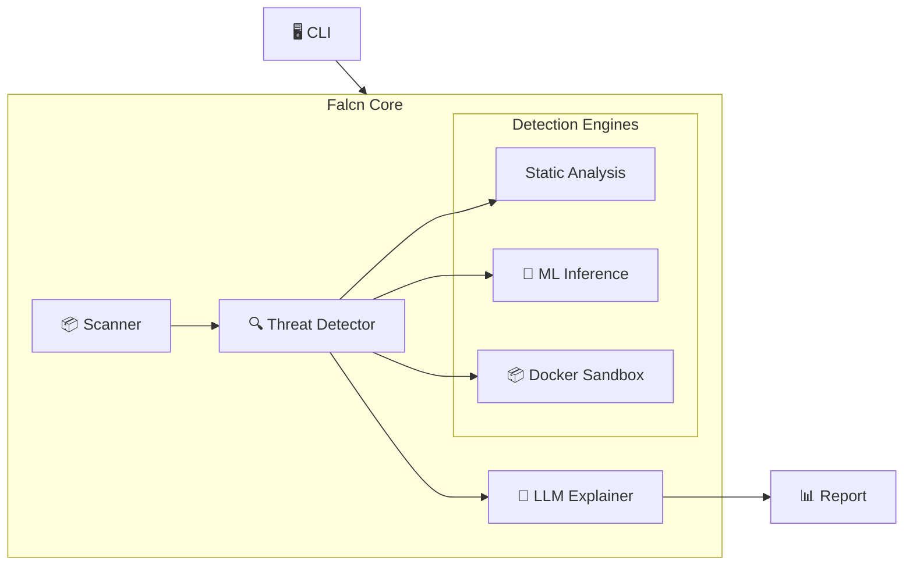

<div align="center">
  
  <h1>Falcn</h1>
  <p><strong>The Next-Gen AI Security Platform for Software Supply Chains</strong></p>
  <p>
    <a href="https://falcn.io">Website</a> •
    <a href="docs/USER_GUIDE.md">Docs</a> •
    <a href="https://github.com/falcn-io/falcn/releases">Releases</a>
  </p>
  <p>
    
    
    
  </p>
</div>

---

**Falcn** is an enterprise-grade, privacy-first supply chain security platform. It combines deterministic heuristics, behavioral analysis, and local AI to explanation threats.

## 🚀 Key Features

### 🔍 Advanced Detection
*   **Heuristics Engine**: Deterministic scoring based on edit distance and namespace patterns.
*   **Behavioral Analysis**: (Optional) Sandbox execution to catch install-time malware.
*   **Vulnerability Scanning**: Integrated checks against OSV and NVD.

### 🤖 Privacy-First AI
*   **Local Explanations**: Uses **Ollama** (Llama 3, Mistral) to explain threats without sending code to the cloud.
*   **Privacy**: Airgap-compatible and fully self-hosted.

## ✨ The "Magic" Demo

See Falcn in action detecting a malicious package:


**Try it yourself:**
```bash
./demo/setup_demo.sh
falcn scan ./falcn-magic-demo
```

## ⚡ Benchmarks

Falcn is designed for speed. Use `--no-llm --no-sandbox` for instant feedback in CI/CD.

| Mode | Time |
|------|------|
| **Fast Mode** (`--no-llm --no-sandbox`) | ~100ms |
| **Full Mode** (Deep Analysis + AI) | ~2-5s |

To run the benchmarks yourself:
```bash
go test -bench . ./tests/benchmark
```

## 💻 Quick Start

**1. Scan a project**
```bash
falcn scan . --check-vulnerabilities
```

**2. Configure AI (Ollama)**
See [Enterprise Ollama Setup](docs/OLLAMA_SETUP.md).
```bash
export FALCN_LLM_ENABLED=true
export FALCN_LLM_PROVIDER=ollama
```

## 🛠️ CLI Flags
- `--check-vulnerabilities`: Enable vulnerability checks
- `--no-llm`: **[NEW]** Disable AI explanations entirely
- `--max-llm-calls <n>`: **[NEW]** Limit AI explanations (default: 10)
- `--no-sandbox`: **[NEW]** Disable dynamic analysis


```yaml
llm:
  enabled: true
  provider: "ollama" # or "openai", "anthropic"
  model: "llama3"
  endpoint: "http://localhost:11434"

ml:
  enabled: true
  model_path: "resources/models/reputation_model.onnx"
  threshold: 0.85
```

## 🏗️ Architecture

Falcn uses a modular AI-native architecture.



For a deep dive, see [ARCHITECTURE.md](docs/ARCHITECTURE.md).

## 🤝 Contributing

We welcome contributions! Please see [CONTRIBUTING.md](CONTRIBUTING.md).

## 📄 License

Falcn is open-source software licensed under the [MIT License](LICENSE).

---
<div align="center">
  <sub>Built with ❤️ by the Falcn Community</sub>
</div>
