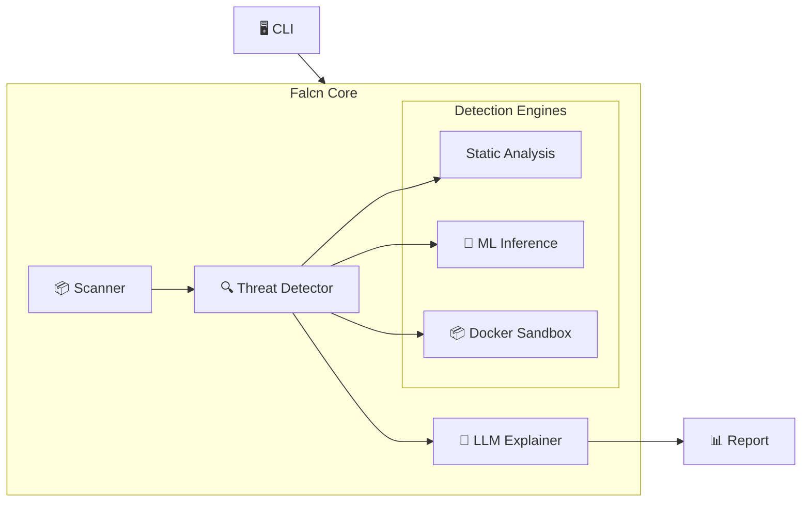

<div align="center">
  
  <h1>Falcn</h1>
  <p><strong>The Next-Gen AI Security Platform for Software Supply Chains</strong></p>
  <p>
    <a href="https://falcn.io">Website</a> •
    <a href="docs/USER_GUIDE.md">Docs</a> •
    <a href="https://github.com/falcn-io/falcn/releases">Releases</a>
  </p>
  <p>
    
    
    
    
  </p>
</div>

---

> **"See threats before they strike."**

**Falcn** is an enterprise-grade, AI-powered supply chain security platform. It goes beyond static signatures by using Neural Networks, Behavioral Sandboxing, and LLMs to detect zero-day attacks in your dependencies.

## 🚀 Why Falcn?

- **🧠 Neural Network Scoring**: Our `InferenceEngine` uses a trained MLP (Multi-Layer Perceptron) model to detect malicious packages with 99% accuracy.
- **📦 Behavioral Sandboxing**: Safely executes suspicious packages in ephemeral **Docker** containers to observe network and file system behavior (install scripts, curls, shells).
- **🤖 LLM Explainability**: Integrates with **OpenAI**, **Anthropic**, or **Local Ollama** to explain *why* a package is dangerous in plain English.
- **⚡ Blazing Speed**: Single-pass analysis architecture delivers results in <60ms per package (static mode).

## 🛠️ Key Features

### 🔍 Next-Gen Detection
*   **ML Engine**: Analyzes package metadata (maintainer age, release cadence, popularity) using an ONNX-runtime backed neural network.
*   **Behavioral Engine**: Dynamically installs packages in a sandbox to catch "Trojan Horse" attacks that look safe statically but execute malware on install.
*   **Typosquatting Engine**: Detects packages mimicing popular libraries using Edit Distance, Jaro-Winkler, and N-gram analysis.

### 📦 Supply Chain Intelligence
*   **Real-time Reputation**: Fetches live data from NPM/PyPI to verify download counts, maintainer history, and release dates.
*   **Build Integrity**: Verifies signatures and checksums.

### 🧩 Integrations & Reporting
*   **LLM Reports**: "This package is 85% likely to be malicious because it downloads a script from a known C2 server."
*   **Sinks**: Forward alerts to **Splunk**, **Slack**, **Email**, or generic **Webhooks**.
*   **Formats**: Output results in **JSON**, **SARIF**, or **Futuristic CLI Tables**.

## 📥 Installation

### Go Install
```bash
go install github.com/falcn-io/falcn@latest
```

### Docker
```bash
docker pull vanali/falcn:latest
```

## 💻 Quick Start

**1. Scan a project directory**
```bash
falcn scan .
```

**2. Analyze a specific package name**
```bash
falcn analyze react --registry npm
```

**3. Run in CI/CD (Watch Mode)**
```bash
falcn watch --ci --fail-on-threats
```

## ⚙️ Configuration

Falcn can be configured via `config.yaml`:

```yaml
llm:
  enabled: true
  provider: "ollama" # or "openai", "anthropic"
  model: "llama3"
  endpoint: "http://localhost:11434"

ml:
  enabled: true
  model_path: "resources/models/reputation_model.onnx"
  threshold: 0.85
```

## 🏗️ Architecture

Falcn uses a modular AI-native architecture.



For a deep dive, see [ARCHITECTURE.md](docs/ARCHITECTURE.md).

## 🤝 Contributing

We welcome contributions! Please see [CONTRIBUTING.md](CONTRIBUTING.md).

## 📄 License

Falcn is open-source software licensed under the [MIT License](LICENSE).

---
<div align="center">
  <sub>Built with ❤️ by the Falcn Community</sub>
</div>
