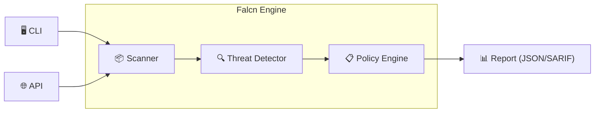

<div align="center">
  
  <h1>Falcn</h1>
  <p><strong>Precision Supply Chain Security Platform</strong></p>
  <p>
    <a href="https://falcn.io">Website</a> •
    <a href="docs/USER_GUIDE.md">Docs</a> •
    <a href="https://github.com/falcn-io/falcn/releases">Releases</a>
  </p>
  <p>
    
    
    
    
  </p>
</div>

---

> **"See threats before they strike."**

**Falcn** is an enterprise-grade, open-source supply chain security platform designed to protect software teams from modern dependency attacks. Built for speed and precision, Falcn provides deep visibility into your software supply chain, detecting typosquatting, brandjacking, and malicious packages across multiple ecosystems with sub-60ms scan times.

## 🚀 Why Falcn?

- **⚡ Blazing Speed**: Single-pass analysis architecture delivers results in <60ms per package.
- **🎯 Surgical Precision**: Advanced algorithms (Levenshtein, Homoglyphs, ML) minimize false positives.
- **🛡️ Proactive Defense**: Blocks malicious packages *before* they enter your build pipeline.
- **🔌 Universal Compatibility**: Seamlessly integrates with GitHub Actions, GitLab CI, Jenkins, and more.

## 📦 Supported Ecosystems

Falcn understands and analyzes dependencies for the world's most popular languages:

| Ecosystem | Manifests | Security Checks |
|-----------|-----------|-----------------|
| **Node.js** | `package.json`, `yarn.lock` | Typosquatting, Malware, License, Age |
| **Python** | `requirements.txt`, `pyproject.toml` | Typosquatting, Version Manip, Sideloading |
| **Go** | `go.mod`, `go.sum` | Checksum Mismatch, Pseudo-version attacks |
| **Java** | `pom.xml`, `build.gradle` | Dependency Confusion, Maven Central verification |
| **.NET** | `*.csproj` | NuGet reputation check |
| **Ruby** | `Gemfile` | Gem hijacking detection |

## 🛠️ Key Features

### 🔍 Advanced Threat Detection
*   **Typosquatting Engine**: Detects packages mimicing popular libraries (e.g., `reqeusts` vs `requests`) using Edit Distance, Jaro-Winkler, and N-gram analysis.
*   **Brandjacking Detection**: Identifies unauthorized use of known corporate brands in package names.
*   **Dependency Confusion**: Alerts on internal package names that claim existence in public registries.
*   **Malware Analysis**: Static analysis to detect obfuscated code, suspicious network calls, and install scripts.

### � Supply Chain Intelligence
*   **Maintainer Reputation**: Scores packages based on maintainer history, commit velocity, and community trust.
*   **Build Integrity**: Verifies signatures and checksums against official registry records.
*   **Dormancy Detection**: Flags packages that have been abandoned or suddenly resurrected (potential account hijacking).

### � Integrations & Reporting
*   **Sinks**: Forward alerts to **Splunk**, **Slack**, **Email**, or generic **Webhooks**.
*   **Formats**: Output results in **JSON**, **SARIF** (GitHub Security tab compatible), or **Futuristic CLI Tables**.
*   **SBOM**: Generate SPDX or CycloneDX software bills of materials automatically.

## 📥 Installation

### Homebrew (macOS/Linux)
```bash
brew tap falcn-io/tap
brew install falcn
```

### Go Install
```bash
go install github.com/falcn-io/falcn@latest
```

### Docker
```bash
docker pull falcn-io/falcn:latest
```

## 💻 Quick Start

**1. Scan a project directory**
```bash
falcn scan .
```

**2. Analyze a specific package name**
```bash
falcn analyze react --registry npm
```

**3. Run in CI/CD (Watch Mode)**
```bash
falcn watch --ci --fail-on-threats
```

## ⚙️ Configuration

Falcn can be configured via `falcn.yaml` in your project root or `~/.falcn.yaml`.

```yaml
app:
  log_level: "info"

scanner:
  include_dev_deps: false
  timeout: "30s"

policies:
  fail_on_threats: true
  min_threat_level: "high"         # low, medium, high, critical

integrations:
  slack:
    enabled: true
    webhook_url: "https://hooks.slack.com/..."
```

## �️ Architecture

Falcn uses a modular architecture separating scanning, detection, and policy enforcement.



For a deep dive, see [ARCHITECTURE.md](docs/ARCHITECTURE.md).

## 🤝 Contributing

We welcome contributions! Please see [CONTRIBUTING.md](CONTRIBUTING.md) for details on how to set up your development environment and submit PRs.

## 📄 License

Falcn is open-source software licensed under the [MIT License](LICENSE).

---
<div align="center">
  <sub>Built with ❤️ by the Falcn Community</sub>
</div>
