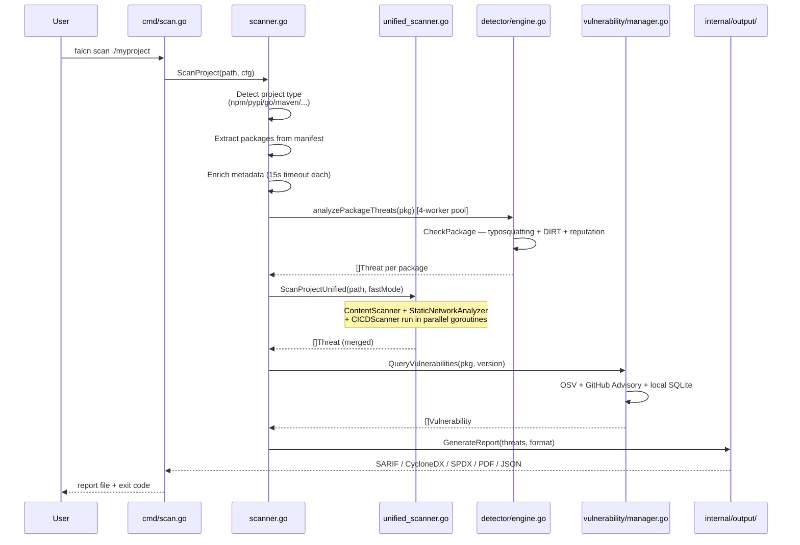
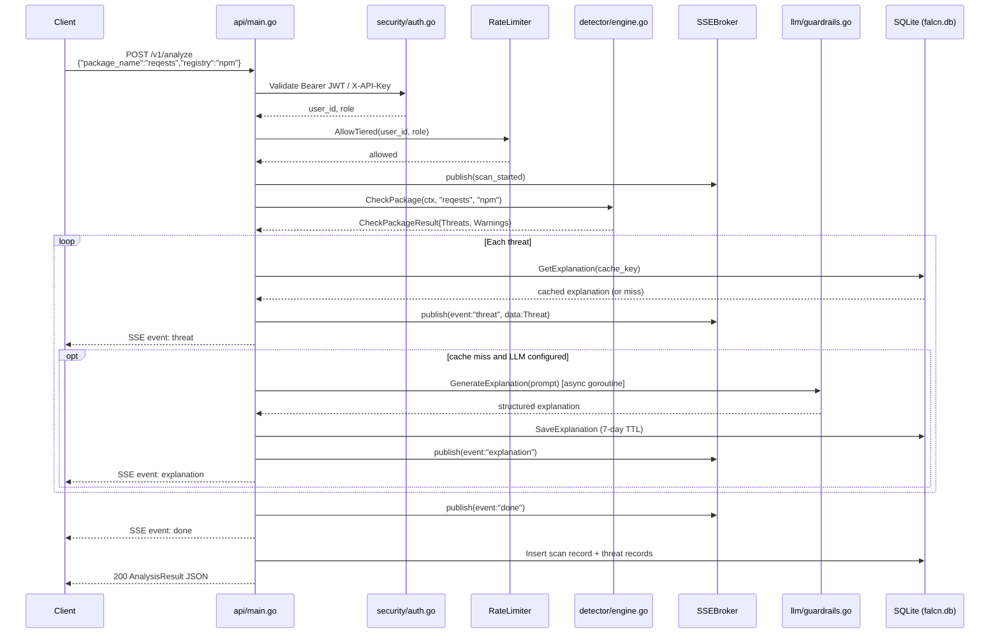
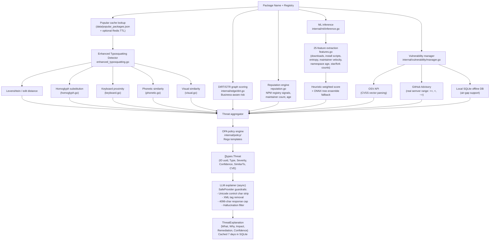

# Falcn Architecture

This document describes the internal architecture of Falcn, a Go-based supply chain security scanner for 8 package ecosystems (npm, PyPI, Maven, Go, NuGet, RubyGems, Cargo, Composer/Packagist).

---

## Contents

- [High-level component diagram](#high-level-component-diagram)
- [Entry points](#entry-points)
- [Scan request flow](#scan-request-flow)
- [Threat detection pipeline](#threat-detection-pipeline)
- [Component reference](#component-reference)
  - [CLI (cmd/)](#cli-cmd)
  - [API server (api/)](#api-server-api)
  - [Scanner engine (internal/scanner/)](#scanner-engine-internalscanner)
  - [Detector engine (internal/detector/)](#detector-engine-internaldetector)
  - [ML pipeline (internal/ml/)](#ml-pipeline-internalml)
  - [Vulnerability databases (internal/vulnerability/)](#vulnerability-databases-internalvulnerability)
  - [Reachability analysis (internal/reachability/)](#reachability-analysis-internalreachability)
  - [LLM explainer (internal/llm/)](#llm-explainer-internalllm)
  - [Policy engine (internal/policy/)](#policy-engine-internalpolicy)
  - [Output formats (internal/output/)](#output-formats-internaloutput)
  - [Container scanning (internal/container/)](#container-scanning-internalcontainer)
  - [Security and RBAC (internal/security/)](#security-and-rbac-internalsecurity)
  - [Configuration (internal/config/)](#configuration-internalconfig)
  - [Popular package cache (internal/detector/popular_cache.go)](#popular-package-cache)
  - [Deployment artifacts (deploy/)](#deployment-artifacts-deploy)

---

## High-level component diagram

```mermaid
graph TD
    subgraph "Entry Points"
        CLI["main.go<br/>Cobra CLI<br/>(cmd/)"]
        API["api/main.go<br/>REST API<br/>(Gorilla Mux)"]
    end

    subgraph "Core Scanner"
        SCAN["internal/scanner/scanner.go<br/>Orchestration + 4-worker pool"]
        UNIFIED["internal/scanner/unified_scanner.go<br/>Concurrent unified scan<br/>(ContentScanner + Network + CICD)"]
        CONTENT["internal/scanner/content_scanner.go<br/>Secrets + obfuscation + binaries"]
        NETWORK["internal/scanner/static_network_analyzer.go<br/>Network call detection"]
        CICD["internal/scanner/cicd_scanner.go<br/>CI/CD injection checks"]
    end

    subgraph "Detection"
        DET["internal/detector/engine.go<br/>CheckPackage() orchestrator"]
        TYPO["internal/detector/enhanced_typosquatting.go<br/>Levenshtein, homoglyph,<br/>keyboard, phonetic"]
        DIRT["internal/edge/dirt.go<br/>DIRT/GTR graph scoring"]
        REP["internal/detector/reputation.go<br/>Ecosystem reputation signals"]
        POP["internal/detector/popular_cache.go<br/>data/popular_packages.json"]
    end

    subgraph "ML Pipeline"
        FEAT["internal/ml/features.go<br/>25-feature extraction"]
        INFER["internal/ml/inference.go<br/>Heuristic + ONNX/tree fallback"]
        FEED["internal/ml/feedback.go<br/>SQLite FeedbackStore<br/>ModelRegistry A/B"]
    end

    subgraph "Vulnerability DBs"
        OSV["internal/vulnerability/osv_database.go<br/>OSV API (api.osv.dev)"]
        GH["internal/vulnerability/github_database.go<br/>GitHub Advisory<br/>Real semver range checks"]
        LOCAL["internal/vulnerability/local_database.go<br/>SQLite offline DB"]
        MGR["internal/vulnerability/manager.go<br/>Aggregator"]
    end

    subgraph "LLM Explainer"
        GUARD["internal/llm/guardrails.go<br/>SafeProvider — unicode strip,<br/>XML injection, 4096-char cap"]
        ANTH["internal/llm/anthropic.go<br/>claude-haiku-4-5"]
        OAI["internal/llm/openai.go<br/>gpt-4o-mini"]
        OLL["internal/llm/ollama.go<br/>local Ollama"]
    end

    subgraph "Output"
        SARIF["internal/output/sarif.go<br/>SARIF 2.1.0 + suppressions"]
        CDX["internal/output/cyclonedx.go<br/>CycloneDX 1.5 + VEX"]
        SPDX["internal/output/spdx.go"]
        PDF["internal/output/pdf_generator.go"]
    end

    subgraph "API Infrastructure"
        JWT["internal/security/auth.go<br/>RS256 JWT"]
        RBAC["internal/security/rbac.go<br/>viewer / analyst / admin / owner"]
        RLIM["api/main.go RateLimiter<br/>tiered token-bucket"]
        SSE["api/main.go SSEBroker<br/>pub/sub real-time events"]
        PROM["internal/api/metrics<br/>Prometheus middleware"]
    end

    subgraph "Policy"
        OPA["internal/policy/<br/>OPA-based Rego engine"]
    end

    subgraph "Config"
        CFG["internal/config/config.go<br/>config_manager.go"]
        ENT["internal/config/enterprise.go<br/>trial/standard/premium/enterprise<br/>SSO, LDAP, SAML, OAuth2"]
    end

    CLI --> SCAN
    API --> DET
    API --> SSE
    API --> RLIM
    API --> JWT
    API --> RBAC

    SCAN --> UNIFIED
    SCAN --> DET
    SCAN --> MGR
    UNIFIED --> CONTENT
    UNIFIED --> NETWORK
    UNIFIED --> CICD

    DET --> TYPO
    DET --> DIRT
    DET --> REP
    DET --> POP
    DET --> FEAT
    FEAT --> INFER

    MGR --> OSV
    MGR --> GH
    MGR --> LOCAL

    GUARD --> ANTH
    GUARD --> OAI
    GUARD --> OLL

    SCAN --> SARIF
    SCAN --> CDX
    SCAN --> SPDX
    SCAN --> PDF
    SCAN --> OPA
    SCAN --> CFG
    CFG --> ENT

    INFER --> FEED
```

---

## Entry points

### main.go — CLI

`main.go` initializes the Cobra command tree from `cmd/` and delegates to the scanner. The Cobra root command wires up subcommands including `scan`, `fix`, and others. CLI scanning calls `internal/scanner/scanner.go` directly, not through the REST API.

### api/main.go — REST API

The REST API server uses Gorilla Mux for routing. It initializes at startup:

- SQLite scan store (`FALCN_DB_PATH`, default `falcn.db`)
- In-memory ring buffer (capacity 500 records) as fallback
- Token-bucket rate limiter with background eviction (every 5 minutes)
- JWT service (RS256; falls back to API-key-only auth on init failure)
- SSE broker for real-time event streaming
- Lazily initialized detector engine and LLM provider

The server supports TLS when `FALCN_TLS_CERT` and `FALCN_TLS_KEY` are set, and performs a 30-second graceful shutdown on `SIGTERM` / `SIGINT`.

---

## Scan request flow

The following diagrams show the two distinct paths a scan takes depending on whether it originates from the CLI or the REST API.

---

## Threat detection pipeline

---

## Component reference

### CLI (cmd/)

The `cmd/` package uses [Cobra](https://github.com/spf13/cobra). The `scan` subcommand accepts a path or package reference, loads config via `internal/config/config_manager.go`, and calls `scanner.ScanProject()`. The `fix` subcommand emits remediation commands based on scan results.

---

### API server (api/)

**File:** `api/main.go`

The API server is a self-contained Go binary. Key architectural decisions:

- **Gorilla Mux** for routing with method constraints.
- **Tiered rate limiter**: in-process token-bucket keyed by JWT `user_id` (or IP as fallback). Redis-backed limiter is activated when `RATE_LIMIT_REDIS_URL` is set.
- **SSEBroker**: a mutex-protected map of `chan SSEEvent` channels. `publish()` is non-blocking; slow clients are skipped rather than stalled. All events flow through the broker so streaming clients see threats in real time.
- **LLM explanation workers**: at most 8 goroutines (`explainSem` buffered channel) generate explanations concurrently. Each goroutine checks SQLite cache first (7-day TTL), calls the LLM on a cache miss, stores the result, then broadcasts an `explanation` SSE event.
- **Graceful shutdown**: `srv.Shutdown()` with 30-second timeout drains in-flight connections. The `serverCtx` context is cancelled on shutdown so all long-running goroutines (LLM workers, rate-limiter eviction) terminate cleanly.
- **Prometheus metrics**: `internal/api/metrics` wraps the Mux with a middleware that records request counts, durations, and status codes. The `/metrics` endpoint is restricted by CIDR allowlist.
- **SQLite persistence**: `internal/database.ScanStore` stores scan records, threat records, and explanation cache. The in-memory ring buffer (capacity 500) serves as a fallback.

---

### Scanner engine (internal/scanner/)

**Primary files:** `scanner.go`, `unified_scanner.go`

`Scanner` in `scanner.go` is the CLI-facing orchestrator. Its `ScanProject()` method:

1. Detects the project type (npm, pypi, go, maven, etc.) via `ProjectDetector` implementations.
2. Extracts `[]*types.Package` from manifest files.
3. Enriches each package with registry metadata (15-second timeout per package).
4. Runs `analyzePackageThreats()` for each package in a **bounded 4-worker pool** to prevent goroutine explosion on large dependency trees.
5. Calls `ScanProjectUnified()` for file-level analysis.
6. Queries the vulnerability manager for CVEs.
7. Passes results through the OPA policy engine.
8. Generates reports via `internal/output/`.

`unified_scanner.go` implements `ScanProjectUnified()`, which:

- Collects all file paths in a single `filepath.WalkDir` pass.
- Fans out **three goroutines in parallel**: `ContentScanner`, `StaticNetworkAnalyzer`, and `CICDScanner`.
- In `--fast` mode, skips network I/O, heavy YAML parsing, and external DB queries; uses lightweight heuristics only. Target wall-clock time in fast mode: under 100 ms.

Other scanner files:

| File | Purpose |
|------|---------|
| `content_scanner.go` | Embedded secrets, obfuscated code, executable binaries |
| `static_network_analyzer.go` | Detects network calls in JS/TS/Python source |
| `cicd_scanner.go` | CI/CD pipeline injection checks (GitHub Actions, GitLab CI, etc.) |
| `optimized_scanner.go` | `ScanPackageParallel()` — parallel package-level scanning |
| `metadata_enricher.go` | Fetches registry metadata to populate `types.PackageMetadata` |
| `auto_detector.go` | Detects project type from directory layout |
| `signature_verifier.go` | Package signature verification |
| `build_artifact_scanner.go` | Scans build artifacts for tampering |

---

### Detector engine (internal/detector/)

**Primary files:** `engine.go`, `enhanced_typosquatting.go`

`detector.New(cfg)` returns an `Engine`. The main entry point is `Engine.CheckPackage(ctx, name, registry)`, which returns a `CheckPackageResult` containing `[]types.Threat` and `[]types.Warning`.

**Typosquatting detection** (`enhanced_typosquatting.go`) is production-grade and combines five independent algorithms, each producing a confidence score. The final score is the maximum across algorithms:

- **Levenshtein / edit distance** — character-level edit distance against the popular package list.
- **Homoglyph substitution** (`homoglyph.go`) — replaces Unicode lookalike characters (e.g. `l` → `1`, `о` → `o`).
- **Keyboard proximity** (`keyboard.go`) — models adjacent-key substitutions on QWERTY layout.
- **Phonetic similarity** (`phonetic.go`) — Soundex/Metaphone comparison for sound-alike names.
- **Visual similarity** (`visual.go`) — character shape similarity beyond strict Unicode confusables.

**DIRT/GTR graph scoring** (`internal/edge/dirt.go`) applies business-aware risk weighting by analyzing the package dependency graph structure.

**Reputation engine** (`reputation.go`) fetches live signals from the npm registry (quality, popularity, maintenance scores) with configurable backoff and retry schedules.

**Popular package cache** (`popular_cache.go`) loads `data/popular_packages.json` at startup. Optionally backed by Redis with a configurable TTL.

---

### ML pipeline (internal/ml/)

**Files:** `features.go`, `inference.go`, `feedback.go`, `tree_inference.go`

The ML pipeline extracts a **25-feature vector** from package metadata and computes a risk score.

**Feature index layout** (`features.go`):

| Index | Feature | Signal |
|-------|---------|--------|
| 0 | log(DownloadCount+1) | higher = safer |
| 1 | MaintainerCount | higher = safer |
| 2 | AgeInDays | very new = riskier |
| 3 | DaysSinceLastUpdate | fresh on new pkg = suspicious |
| 4 | VulnerabilityCount | higher = riskier |
| 5 | MalwareReportCount | any = very risky |
| 6 | VerifiedFlagCount | higher = safer |
| 7 | HasInstallScript | presence = riskier |
| 8 | InstallScriptSizeKB | large = riskier |
| 9 | HasPreinstallScript | presence = riskier |
| 10 | HasPostinstallScript | presence = riskier |
| 11 | MaintainerChangeCount (90d) | many changes = riskier |
| 12 | MaintainerVelocity (changes/day) | high velocity = riskier |
| 13 | DomainAgeOfAuthorEmail (days) | young domain = riskier |
| 14 | ExecutableBinaryCount | any = riskier |
| 15 | NetworkCodeFileCount | many = riskier |
| 16 | log(TotalFileCount+1) | context normalization |
| 17 | EntropyMaxFile (Shannon, 0–8) | very high = obfuscation |
| 18 | DependencyDelta | large positive = riskier |
| 19 | log(PreviousVersionCount+1) | very few = riskier |
| 20 | DaysBetweenVersions | very short = rushed release |
| 21 | log(StarCount+1) | higher = safer |
| 22 | log(ForkCount+1) | higher = safer |
| 23 | NamespaceAgeDays | young namespace = riskier |
| 24 | DownloadStarRatioAnomaly | very high downloads + zero stars = suspicious |

`NormalizeFeatures()` applies z-score normalization across the vector.

`inference.go` implements `Predict()` with calibrated per-feature weights and a `PredictBatch()` helper. When an ONNX model file is present, it is used; otherwise the heuristic weighted scorer or `tree_inference.go` is used as a fallback.

`feedback.go` implements `FeedbackStore` (SQLite) for recording analyst verdicts and `ModelRegistry` for A/B testing between model versions. `ExportTrainingCSV()` exports labeled data for periodic model retraining.

---

### Vulnerability databases (internal/vulnerability/)

**Files:** `osv_database.go`, `github_database.go`, `local_database.go`, `manager.go`

`manager.go` aggregates results from all three sources with a configurable priority order.

**OSV database** (`osv_database.go`): queries `https://api.osv.dev/v1`. CVSS severity is computed by parsing the full CVSS vector string (AV, AC, PR, UI, S, C, I, A components), not by string matching.

**GitHub Advisory database** (`github_database.go`): queries the GitHub GraphQL API. Version range checking uses real semver comparison supporting `>=`, `<`, `<=`, `>`, `~=`, and `=` operators via a `compareSemver()` function.

**Local SQLite database** (`local_database.go`): used in air-gap and FIPS environments where external network calls to OSV or GitHub are unavailable.

---

### Reachability analysis (internal/reachability/)

Determines whether a vulnerable function in a dependency is actually reachable from the application's entry points. Implements analyzers for Go, Python, and JavaScript/TypeScript. Reduces false positives by filtering vulnerabilities to only those reachable through the real call graph.

---

### LLM explainer (internal/llm/)

**Files:** `guardrails.go`, `llm.go`, `anthropic.go`, `openai.go`, `ollama.go`, `prompts.go`

`SafeProvider` in `guardrails.go` wraps any `Provider` implementation with security guardrails applied to both input and output:

- **Input sanitization**: strips Unicode control characters and removes XML tags from the evidence string to prevent prompt injection.
- **Sandwich defense**: wraps evidence in `<evidence>` tags with a system prompt prepended and a task instruction appended.
- **Output cap**: truncates responses at **4096 characters** to prevent unbounded memory use.
- **Hallucination filter**: detects refusal patterns and returns `"AI Analysis Unavailable (Safety Filter)"` rather than propagating model refusals.

`NewProvider()` selects a backend based on `FALCN_LLM_PROVIDER`:

| Value | Backend | Default model |
|-------|---------|---------------|
| `anthropic` | `anthropic.go` | `claude-haiku-4-5` |
| `openai` | `openai.go` | `gpt-4o-mini` |
| `ollama` | `ollama.go` | `llama3` (configurable via `OLLAMA_MODEL`) |
| _(auto)_ | Tries Anthropic then OpenAI based on API key presence | — |

`prompts.go` exposes `BuildExplanationPrompt()` and `ParseStructuredExplanation()`, which parse the model's free-text output into the structured `ThreatExplanation` schema (`What`, `Why`, `Impact`, `Remediation`, `Confidence`).

---

### Policy engine (internal/policy/)

OPA-based policy evaluation using Rego templates. Accepts scan results and applies organization-specific compliance policies (e.g. blocking any package with a critical CVE, enforcing allowed ecosystem lists). Integrates into the scanner pipeline after threat detection and before report generation.

---

### Output formats (internal/output/)

**Files:** `sarif.go`, `cyclonedx.go`, `spdx.go`, `pdf_generator.go`, `report_generator.go`, `formatter.go`

| Format | Standard | Notes |
|--------|---------|-------|
| SARIF | SARIF 2.1.0 | Includes rule definitions and suppression records |
| CycloneDX | CycloneDX 1.5 | Includes VEX (Vulnerability Exploitability eXchange) analysis field |
| SPDX | SPDX 2.3 | JSON serialization |
| PDF | — | Go template-based PDF generation |
| JSON | — | Falcn native schema with severity breakdown and threat_breakdown by type |

Report generation in the API (`POST /v1/reports/generate`) builds from up to 500 threat records fetched from SQLite, then streams the result as a file download attachment.

---

### Container scanning (internal/container/)

**Files:** Dockerfile scanner + OSV vulnerability checker

Scans container images by pulling and inspecting individual layers. Checks each layer's package manifest against the OSV vulnerability database. Also inspects raw Dockerfile instructions for common misconfigurations (running as root, privileged mode, use of `ADD` with remote URLs, etc.). Supports private registries via username/password or bearer token credentials.

---

### Security and RBAC (internal/security/)

**Files:** `rbac.go`, `auth.go`, `audit_logger.go`, `attack_detector.go`, `input_validator.go`, `fips.go`

**RBAC** (`rbac.go`) defines four roles with strictly ordered privilege levels:

| Role | Rank | Key permissions |
|------|------|----------------|
| `viewer` | 1 | `scan:read`, `vuln:read`, `policy:read` |
| `analyst` | 2 | viewer + `scan:create`, `integration:read` |
| `admin` | 3 | analyst + `scan:delete`, `policy:write`, `user:write`, `audit:read`, `billing:read` |
| `owner` | 4 | admin + `user:delete`, `billing:write`, `org:delete` |

`RequireRole(minimum, next)` is an HTTP middleware that reads the role from request context (injected by `authMiddleware` after JWT validation) and returns `403 Forbidden` if the role is insufficient.

**JWT auth** (`auth.go`) uses RS256 signing. `RequireEnvJWTKey()` loads the private key from `FALCN_JWT_PRIVATE_KEY_FILE` or `FALCN_JWT_PRIVATE_KEY`. Tokens expire after 24 hours.

**Input validator** (`input_validator.go`) validates package names and registry identifiers before they reach the detector engine, preventing path traversal and shell injection.

**FIPS mode** (`fips.go`, `fips_off.go`) provides build-tag-controlled FIPS 140-2 compliant cryptography. The build tag `fips` enables the FIPS build path.

**Audit logger** (`audit_logger.go`) records authenticated actions to configurable destinations (file, SQLite, syslog, webhook).

---

### Configuration (internal/config/)

**Files:** `config.go`, `config_manager.go`, `enterprise.go`, `smart_defaults.go`, `repository.go`

`config_manager.go` exposes `NewManager().Load(dir)` which searches for `falcn.yaml` / `falcn.yml` in the given directory. `Get()` returns the parsed `*Config`.

`enterprise.go` defines `EnterpriseConfig` with four license tiers:

| Tier | MaxUsers (default) | MaxScans (default) |
|------|-------------------|-------------------|
| `trial` | 5 | 100 |
| `standard` | configurable | configurable |
| `premium` | configurable | configurable |
| `enterprise` | configurable | configurable |

Enterprise features include: SSO (OIDC, SAML, OAuth2), LDAP integration, MFA (TOTP, SMS, email), AES-256-GCM or ChaCha20-Poly1305 encryption at rest, audit logging (file / SQLite / syslog / webhook), TLS mutual auth, and secrets management (HashiCorp Vault, AWS Secrets Manager, Azure Key Vault, GCP Secret Manager).

---

### Popular package cache

**Files:** `internal/detector/popular_cache.go`, `data/popular_packages.json`

`popular_packages.json` ships with Falcn and contains the corpus of well-known packages used as the baseline for typosquatting comparison. `PopularCache` loads this file at startup and optionally backs the cache with Redis (configurable TTL, backoff schedule, and npm quality/popularity/maintenance weighting via Viper).

---

### Deployment artifacts (deploy/)

| Path | Purpose |
|------|---------|
| `deploy/github-action/action.yml` | Published GitHub Action. Caches the Falcn binary, annotates PRs with threat findings, enforces a fail-on-severity gate. |
| `deploy/gitlab-template/.gitlab-ci.yml` | GitLab CI include template with full scan and fast-gate jobs. |
| `deploy/pre-commit-hook/falcn-pre-commit` | Pre-commit hook that blocks `git commit` when dependency manifest changes introduce high-risk packages. |
| `deploy/ci-examples/github-actions.yml` | Reference GitHub Actions workflow example. |
| `deploy/ci-examples/gitlab-ci.yml` | Reference GitLab CI example. |
