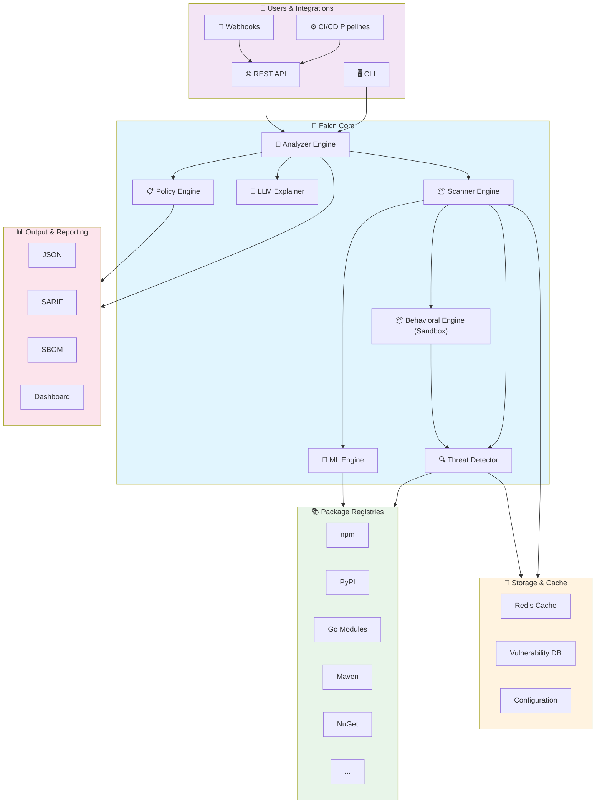
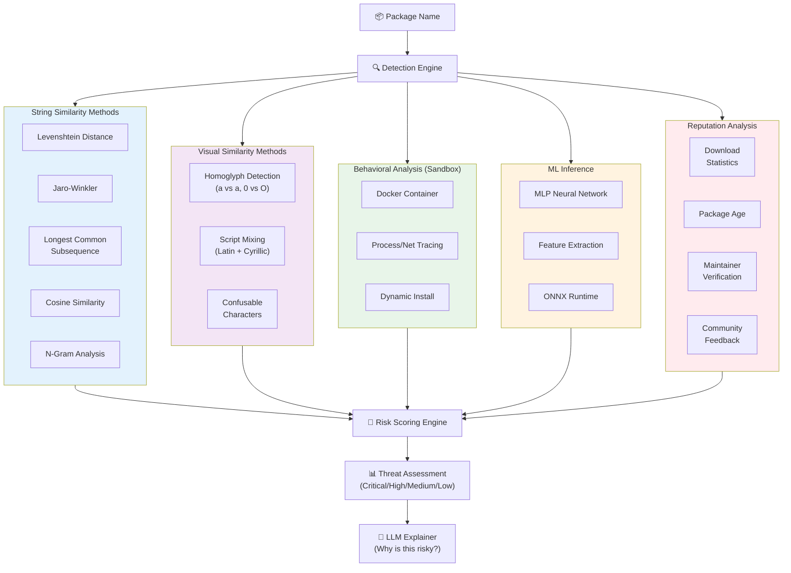
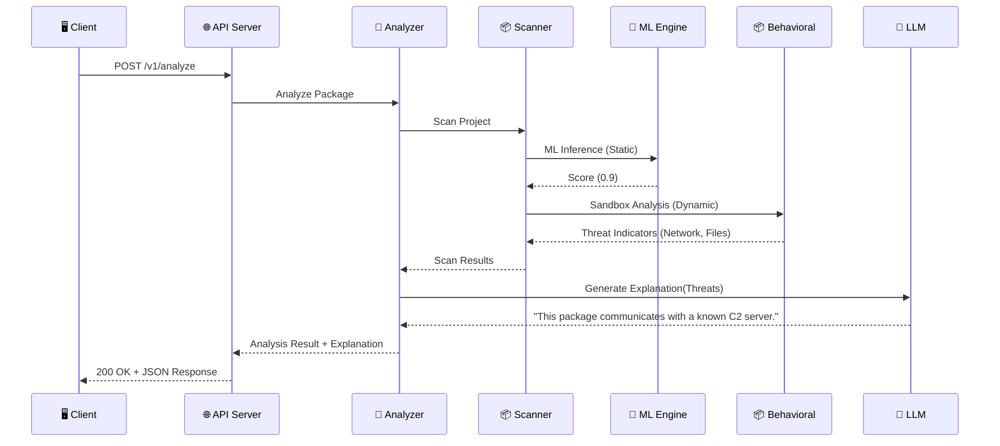

# Falcn Architecture & Reference

This document provides a comprehensive overview of the Falcn architecture, command-line interface, and feature set.

## 1. High-Level System Architecture

## 2. Detection Methods Architecture

## 3. Architecture Clarification: Scanner vs Analyzer

| Component | Package | Role | Responsibilities |
|-----------|---------|------|------------------|
| **Analyzer** | `internal/analyzer` | **The Brain (Orchestrator)** | • Integration point for CLI/API. • Orchestrates the entire flow. • Resolves dependency graphs (Resolution). • Aggregates results from Detectors and Scanner. • Invokes LLM for explanation. • Determines final Risk Scores. |
| **Scanner** | `internal/scanner` | **The Eyes (Discovery)** | • Crawls the file system. • Detects project types (e.g., NPM, PyPI). • Parses manifest files (Extraction). • Runs file-level scans (Content, CI/CD). • Returns raw `Package` objects. |

**Flow:** `CLI/API` -> `Analyzer.Scan()` -> `Scanner.ScanProject()`

## 4. API Request Flow

